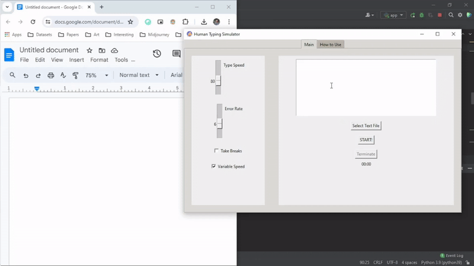

# Human-Like-Typing-Simulator
This project provides a solution for students and educators in environments where typing authenticity is scrutinized.

## Demo

## Motivation
This project provides a solution for students and educators in environments where typing authenticity is scrutinized using tools like Google Docs, which allow viewing of editing history. Many educational systems check if a student has manually typed an assignment or simply pasted it from another source. Our Human-Like Typing Simulator is designed to mimic human typing behavior, complete with realistic typing speeds, error rates, and optional bathroom breaks, thus passing through such filters and proving the authenticity of manual typing.

## About the Project
The Human-Like Typing Simulator is a desktop application built with Python and Tkinter. It simulates human typing, allowing users to input text manually, from a file, or via copy-paste, and then mimics typing this text into any text editor or word processor. The application is equipped with features to adjust the typing speed, introduce typing errors, and simulate breaks to enhance the authenticity of the typing pattern.

## Features
- **Text Input:** Type, paste, or load text from a file.
- **Customizable Typing Speed:** Adjust the typing speed to match various human typing capabilities.
- **Error Simulation:** Introduce common typing errors and correct them to mimic natural typing behavior.
- **Formatting Options:** Apply bold (**bold**) or italic (*italic*) formatting with simple markers "**" or "*".
- **Variable Speed:** Make the typing speed less consistent to appear more human-like.
- **Break Simulation:** Optionally include rare long breaks to simulate away-from-keyboard activities like resting or researching.

## Dependecies
- Python 3.x
- Tkinter: `pip intall tk`
- Keyboard: `pip intall keyboard`

## Usage Instructions
1. Setup: Open the application and enter or load your text. Set the desired typing speed, error rate, and other parameters.
2. Start Typing: Click the "START" button, then quickly position your cursor in the text editor where you want the text to be typed.
3. Monitor: A 5-second countdown will initiate. After this, the typing simulation begins.
4. Terminate: If you need to stop the simulation at any point, click the "Terminate" button.

## Note
If the typing does not initiate, you may need to run the program with administrator privileges, especially on Windows.

## Contribute
Contributions to the project are welcome. Please fork the repository and submit pull requests with your suggested changes.
